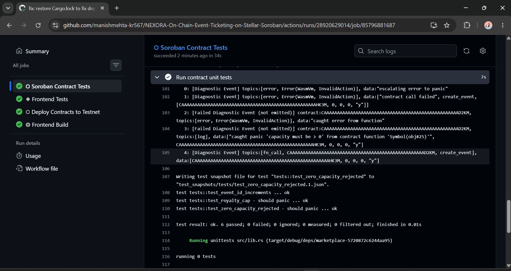
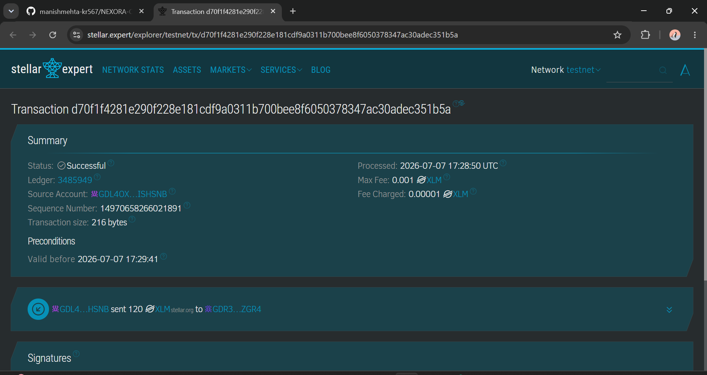

# 🚀 NEXORA v2 — On-Chain Event Ticketing on Stellar Soroban

NEXORA is a fully decentralized, production-ready event ticketing platform built on Stellar (Soroban). Tickets are NFTs minted on-chain, ownership is verifiable, and secondary market royalties are enforced atomically by smart contracts — no middlemen, no ticket scalping abuse.

## 🔗 Live Demo & Video Pitch
- **Live Platform**: [https://nexora-on-chain-event-ticketing-on-omega.vercel.app/](https://nexora-on-chain-event-ticketing-on-omega.vercel.app/)
- **Demo Video**: [Watch the Demo on Google Drive](https://drive.google.com/file/d/1f7ZckkHdnPu9UOyyB_gaWt4xQarqbLTj/view?usp=sharing)

## 🌟 Key Features

1. **On-Chain Ticket Minting**: Create events with capacity and price caps. Buy tickets that are minted as NFTs directly to your Stellar wallet.
2. **Escrow Secondary Market**: List your tickets on the decentralized secondary market. Smart contracts act as trustless escrow.
3. **Atomic Royalty Splits**: When a ticket is resold on the secondary market, the contract automatically splits the payment, sending the creator their predefined royalty instantly.
4. **Real Wallet Integration**: Full Freighter wallet connection with live balance tracking and real cryptographic transaction signing on the Stellar Testnet.
5. **Premium UI**: Built with React, Vite, and Vanilla CSS featuring a stunning bioluminescent deep-sea dark mode, glassmorphism, and neon accents. Fully mobile responsive.

---

## 📸 Platform Gallery & Submission Requirements

As per the submission checklist, here are the required screenshots demonstrating the platform's capabilities:

### 1. Mobile Responsive UI
The platform is fully responsive and optimized for mobile devices.

*(Please add your screenshot to the `screenshots/` folder with this name)*

### 2. CI/CD Pipeline Running
Automated GitHub Actions workflow running tests, building WASM, and deploying the frontend.

*(Please add your screenshot to the `screenshots/` folder with this name)*

### 3. Test Output (Passing Tests)
Comprehensive Rust integration tests validating the smart contract logic.

*(Please add your screenshot to the `screenshots/` folder with this name)*

### 4. Stellar Explorer Verification
Real transactions successfully submitted to the Stellar Testnet and verifiable on Stellar Expert.

*(Please add your screenshot to the `screenshots/` folder with this name)*

---

## 🏗️ Architecture

```
┌─────────────────────────────────────────────────┐
│               React 18 Frontend                  │
│   Vite + TypeScript + Bioluminescent Design      │
└──────────────────┬──────────────────────────────┘
                   │ Soroban RPC / Horizon API
        ┌──────────┴──────────┐
        │                     │
┌───────▼────────┐   ┌────────▼────────┐
│  EventTicket   │◄──│   Marketplace   │
│   Contract     │   │    Contract     │
│                │   │                 │
│ create_event   │   │ list()          │
│ buy_ticket     │   │ buy()  ←──────── royalty split
│ transfer       │   │ cancel()        │
│ check_in       │   │                 │
└───────┬────────┘   └─────────────────┘
```

The Marketplace calls EventTicket via `contractimport!` for ownership transfers and royalty BPS lookup, demonstrating real inter-contract communication.

## 🚀 Quick Start

### Prerequisites
- Node.js 20+
- Rust + `wasm32-unknown-unknown` target
- [Stellar CLI](https://developers.stellar.org/docs/tools/stellar-cli) v22+
- [Freighter Wallet](https://www.freighter.app/)

### Smart Contracts

```bash
# Test
cargo test --workspace

# Build
cargo build --target wasm32-unknown-unknown --release
```

### Frontend

```bash
cd frontend
npm install
npm run dev          # http://localhost:5173
```

## 🔗 Deployed Contracts

| Contract | Testnet Address |
|---|---|
| EventTicket | `CAIRVZ6DNVMH543WDVD5FPYF5UMOYSQSA4C5D5R5GVF5WJG54H7EVRMC` |
| Marketplace | `CB37Z3TFONEVJV5LT5FSE52AOAUPL6XSNI33527MUZAPJSYVZW42CKDE` |

## 📄 License
MIT — built for the Stellar Hackathon.
